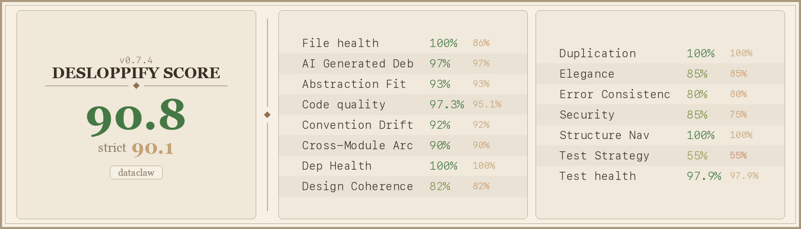

# DataClaw

> **This is a performance art project.** Anthropic built their models on the world's freely shared information, then introduced increasingly [dystopian data policies](https://www.anthropic.com/news/detecting-and-preventing-distillation-attacks) to stop anyone else from doing the same — pulling up the ladder behind them. DataClaw lets you throw the ladder back down. The dataset it produces may or may not be useful for training, but the point is that it's yours to share.

Turn your Claude Code and Codex conversation history into structured training data and publish it to Hugging Face with a single command. DataClaw parses session logs, redacts secrets and PII, and uploads the result as a ready-to-use dataset.


Every export is tagged **`dataclaw`** on Hugging Face. Together, they may someday form a growing [distributed dataset](https://huggingface.co/datasets?other=dataclaw) of real-world human-AI coding collaboration.

## Give this to your agent

Paste this into Claude Code, Codex, or any coding agent:

```
Help me export my Claude Code and Codex conversation history to Hugging Face using DataClaw.
Install it, set up the skill, then walk me through the process.

STEP 1 — INSTALL
  pip install dataclaw
  If that fails: git clone https://github.com/banodoco/dataclaw.git /tmp/dataclaw && pip install /tmp/dataclaw
  If that also fails, ask the user where the source is.

STEP 2 — INSTALL SKILL
  dataclaw update-skill claude

STEP 3 — START
  dataclaw prep
  Every dataclaw command outputs next_steps in its JSON — follow them through the entire flow.

STEP 3A — PRESENT ALL FOLDERS (REQUIRED BEFORE EXPORT)
  dataclaw list
  Send the FULL project/folder list to the user in a message (name, source, sessions, size, excluded).
  Ask which projects to exclude.
  dataclaw config --exclude "project1,project2" OR dataclaw config --confirm-projects
  Do not export until folder selection is explicitly confirmed.

STEP 4 — REVIEW + CONFIRM (REQUIRED BEFORE PUSH)
  dataclaw export --no-push --output /tmp/dataclaw_export.jsonl
  Review PII findings and apply excludes/redactions as needed.
  Full name is requested for an exact-name privacy scan against the export.
  If the user declines sharing full name, use --skip-full-name-scan and attest the skip reason.
  dataclaw confirm --full-name "THEIR FULL NAME" --attest-full-name "..." --attest-sensitive "..." --attest-manual-scan "..."

STEP 5 — PUBLISH (ONLY AFTER EXPLICIT USER APPROVAL)
  dataclaw export --publish-attestation "User explicitly approved publishing to Hugging Face."
  Never publish unless the user explicitly says yes.

IF ANY COMMAND FAILS DUE TO A SKIPPED STEP:
  Restate the 5-step checklist above and resume from the blocked step (do not skip ahead).

IMPORTANT: Never run bare `huggingface-cli login` — always use --token.
IMPORTANT: Always export with --no-push first and review for PII before publishing.
```

<details>
<summary><b>Manual usage (without an agent)</b></summary>

### Quick start

```bash
pip install dataclaw
huggingface-cli login --token YOUR_TOKEN

# See your projects
dataclaw prep
dataclaw list  # Present full list and confirm folder scope before export

# Configure
dataclaw config --repo username/my-personal-codex-data
dataclaw config --exclude "personal-stuff,scratch"
dataclaw config --redact-usernames "my_github_handle,my_discord_name"
dataclaw config --redact "my-domain.com,my-secret-project"

# Export locally first
dataclaw export --no-push

# Review and confirm
dataclaw confirm \
  --full-name "YOUR FULL NAME" \
  --attest-full-name "Asked for full name and scanned export for YOUR FULL NAME." \
  --attest-sensitive "Asked about company/client/internal names and private URLs; none found or redactions updated." \
  --attest-manual-scan "Manually scanned 20 sessions across beginning/middle/end and reviewed findings."

# Optional if user declines sharing full name
dataclaw confirm \
  --skip-full-name-scan \
  --attest-full-name "User declined to share full name; skipped exact-name scan." \
  --attest-sensitive "Asked about company/client/internal names and private URLs; none found or redactions updated." \
  --attest-manual-scan "Manually scanned 20 sessions across beginning/middle/end and reviewed findings."

# Push
dataclaw export --publish-attestation "User explicitly approved publishing to Hugging Face."
```

### Commands

| Command | Description |
|---------|-------------|
| `dataclaw status` | Show current stage and next steps (JSON) |
| `dataclaw prep` | Discover projects, check HF auth, output JSON |
| `dataclaw prep --source codex` | Prep using only Codex sessions |
| `dataclaw prep --source claude` | Prep using only Claude Code sessions |
| `dataclaw list` | List all projects with exclusion status |
| `dataclaw list --source codex` | List only Codex projects |
| `dataclaw config` | Show current config |
| `dataclaw config --repo user/my-personal-codex-data` | Set HF repo |
| `dataclaw config --exclude "a,b"` | Add excluded projects (appends) |
| `dataclaw config --redact "str1,str2"` | Add strings to always redact (appends) |
| `dataclaw config --redact-usernames "u1,u2"` | Add usernames to anonymize (appends) |
| `dataclaw config --confirm-projects` | Mark project selection as confirmed |
| `dataclaw export --no-push` | Export locally only (always do this first) |
| `dataclaw export --source codex --no-push` | Export only Codex sessions locally |
| `dataclaw export --source claude --no-push` | Export only Claude Code sessions locally |
| `dataclaw confirm --full-name "NAME" --attest-full-name "..." --attest-sensitive "..." --attest-manual-scan "..."` | Scan for PII, run exact-name privacy check, verify review attestations, unlock pushing |
| `dataclaw confirm --skip-full-name-scan --attest-full-name "..." --attest-sensitive "..." --attest-manual-scan "..."` | Skip exact-name scan when user declines sharing full name (requires skip attestation) |
| `dataclaw export --publish-attestation "..."` | Export and push (requires `dataclaw confirm` first) |
| `dataclaw export --all-projects` | Include everything (ignore exclusions) |
| `dataclaw export --no-thinking` | Exclude extended thinking blocks |
| `dataclaw update-skill claude` | Install/update the dataclaw skill for Claude Code |

</details>

<details>
<summary><b>What gets exported</b></summary>

| Data | Included | Notes |
|------|----------|-------|
| User messages | Yes | Full text (including voice transcripts) |
| Assistant responses | Yes | Full text output |
| Extended thinking | Yes | Claude's reasoning (opt out with `--no-thinking`) |
| Tool calls | Yes | Tool name + summarized input |
| Tool results | No | Not stored in session logs |
| Token usage | Yes | Input/output tokens per session |
| Model & metadata | Yes | Model name, git branch, timestamps |

### Privacy & Redaction

DataClaw applies multiple layers of protection:

1. **Path anonymization** — File paths stripped to project-relative
2. **Username hashing** — Your macOS username + any configured usernames replaced with stable hashes
3. **Secret detection** — Regex patterns catch JWT tokens, API keys (Anthropic, OpenAI, HF, GitHub, AWS, etc.), database passwords, private keys, Discord webhooks, and more
4. **Entropy analysis** — Long high-entropy strings in quotes are flagged as potential secrets
5. **Email redaction** — Personal email addresses removed
6. **Custom redaction** — You can configure additional strings and usernames to redact
7. **Tool input pre-redaction** — Secrets in tool inputs are redacted BEFORE truncation to prevent partial leaks

**This is NOT foolproof.** Always review your exported data before publishing.
Automated redaction cannot catch everything — especially service-specific
identifiers, third-party PII, or secrets in unusual formats.

To help improve redaction, report issues: https://github.com/banodoco/dataclaw/issues

</details>

<details>
<summary><b>Data schema</b></summary>

Each line in `conversations.jsonl` is one session:

```json
{
  "session_id": "abc-123",
  "project": "my-project",
  "model": "claude-opus-4-6",
  "git_branch": "main",
  "start_time": "2025-06-15T10:00:00+00:00",
  "end_time": "2025-06-15T10:30:00+00:00",
  "messages": [
    {"role": "user", "content": "Fix the login bug", "timestamp": "..."},
    {
      "role": "assistant",
      "content": "I'll investigate the login flow.",
      "thinking": "The user wants me to look at...",
      "tool_uses": [{"tool": "Read", "input": "src/auth.py"}],
      "timestamp": "..."
    }
  ],
  "stats": {
    "user_messages": 5, "assistant_messages": 8,
    "tool_uses": 20, "input_tokens": 50000, "output_tokens": 3000
  }
}
```

Each HF repo also includes a `metadata.json` with aggregate stats.

</details>

<details>
<summary><b>Finding datasets on Hugging Face</b></summary>

All repos are named `{username}/my-personal-codex-data` and tagged `dataclaw`.

- **Browse all:** [huggingface.co/datasets?other=dataclaw](https://huggingface.co/datasets?other=dataclaw)
- **Load one:**
  ```python
  from datasets import load_dataset
  ds = load_dataset("alice/my-personal-codex-data", split="train")
  ```
- **Combine several:**
  ```python
  from datasets import load_dataset, concatenate_datasets
  repos = ["alice/my-personal-codex-data", "bob/my-personal-codex-data"]
  ds = concatenate_datasets([load_dataset(r, split="train") for r in repos])
  ```

The auto-generated HF README includes:
- Model distribution (which Claude models, how many sessions each)
- Total token counts
- Project count
- Last updated timestamp

</details>

## Code Quality

<p align="center">
  
</p>

## License

MIT
